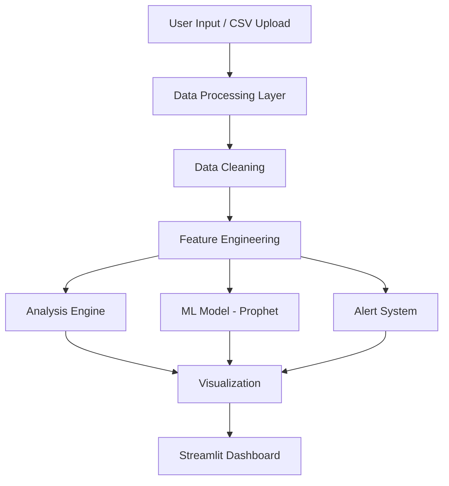
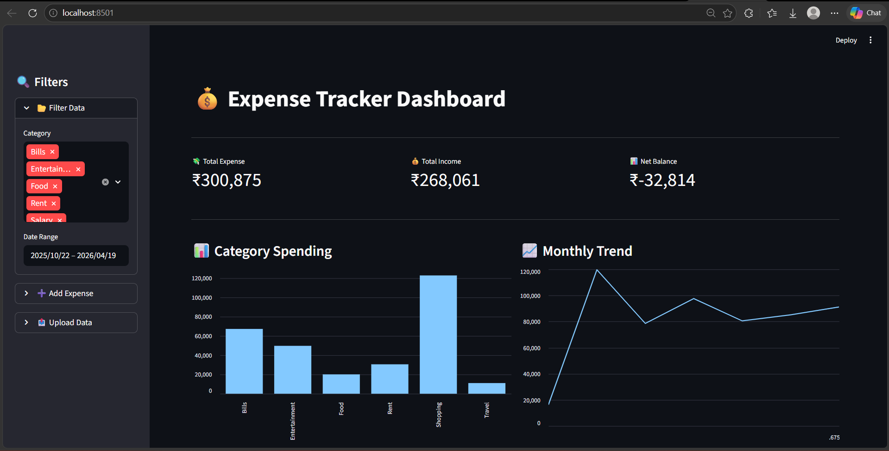
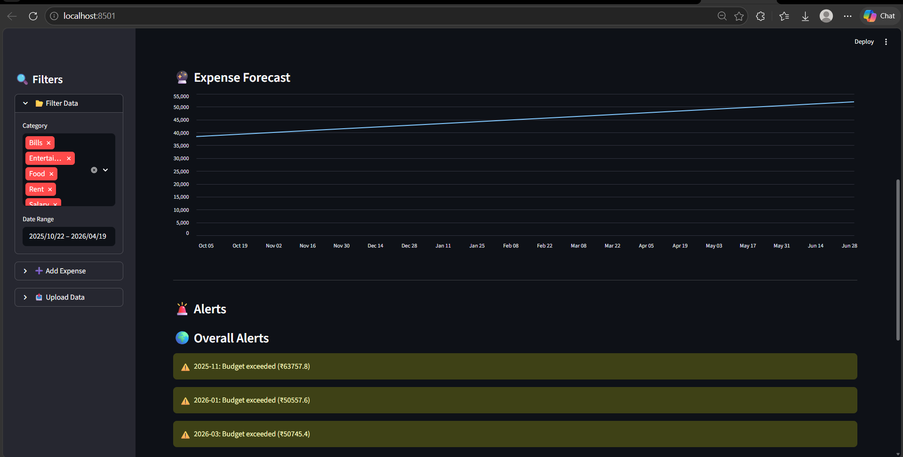
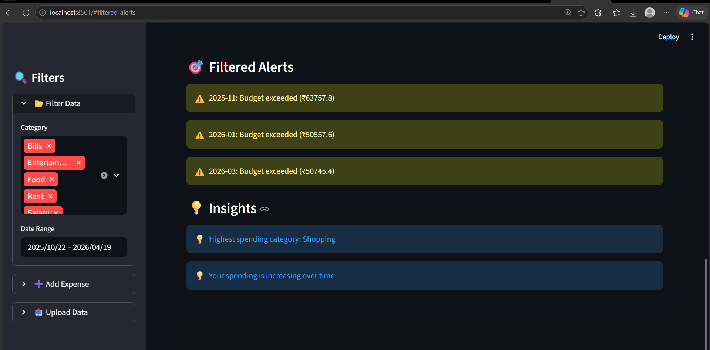

# 💰 Expense Tracker App using Data Science

> 🚀 A full-stack data-driven expense analytics system with forecasting, alerts, and interactive dashboard built using Python & Streamlit.

---

## 📌 Overview

The **Expense Tracker App** is a data science project designed to help users **track, analyze, and predict their expenses**.

It transforms raw financial data into:
- 📊 Clear visual insights  
- 🔮 Future expense predictions  
- 🚨 Budget alerts  
- 💡 Smart financial recommendations  

---

## 🎯 Problem Statement

Managing expenses manually is inefficient and lacks insights.

Users struggle to:
- Track spending patterns  
- Identify overspending  
- Predict future expenses  
- Make data-driven financial decisions  

---

## 💡 Solution

This project provides:
- Automated expense tracking  
- Category-based analysis  
- Time-series forecasting (Prophet)  
- Budget alert system  
- Interactive dashboard  

---

## 🧠 System Architecture


### ⚙️ Tech Stack
**🧾 Data Processing**
Python
Pandas
NumPy
**📊 Visualization**
Matplotlib
Seaborn
Plotly
**🤖 Machine Learning**
Prophet (Time Series Forecasting)
**🌐 App Framework**
Streamlit
**🔌 Integration**
CSV Upload / User Input

### ✨ Features

**📊 Data Analysis**
Category-wise spending
Monthly trends
Weekday analysis
**🔮 Forecasting**
Predict future expenses using Prophet
Trend & seasonality modeling
**🚨 Alerts System**
Monthly budget alerts
Category-wise overspending alerts
**💡 Insights Engine**
Auto-generated financial insights
Behavior-based recommendations
**🎛️ Interactive Dashboard**
Filters (category, date range)
Real-time updates
KPI metrics
**📥 Data Input**
Manual expense entry
Bulk CSV upload

## 📸 Dashboard Preview

### 🖥️ Overview


### 🔮 Forecast & Alerts


### 🎯 Filtered Insights



### 📂 Project Structure
``` text
Expense-Tracker-App/
│
├── data/
│   ├── raw_expenses.csv
│   └── cleaned_expenses.csv
│
├── notebooks/
│   └── eda.ipynb
│
├── src/
│   ├── data_loader.py
│   ├── data_cleaning.py
│   ├── analysis.py
│   ├── visualization.py
│   ├── ml_model.py
│   ├── alerts.py
│   └── api_integration.py
│
├── app/
│   └── app.py
│
├── outputs/
│   └── charts/
│
├── images/
│   ├── dashboard_overview.png
│   ├── forecast_and_alerts.png
│   └── filtered_insights.png
│
├── requirements.txt
└── README.md
```

### ⚡ Installation & Setup
1️⃣ Clone Repository
git clone https://github.com/Vani691/expense-tracker-data-science-app.git
cd expense-tracker-app

2️⃣ Create Virtual Environment
python -m venv venv
venv\Scripts\activate   # Windows

3️⃣ Install Dependencies
pip install -r requirements.txt

4️⃣ Run Application
streamlit run app/app.py

### 📊 Example Insights
💡 Highest spending category: Shopping
💡 Spending increases over time
💡 Weekend expenses are higher

### 🚀 Future Improvements
📱 Mobile app integration
🔔 Real-time notifications
🤖 AI-based budgeting assistant
🔗 Bank API integration (Plaid / Razorpay)
🗄️ Database integration (SQLite / PostgreSQL)

### 🧠 Key Learnings
Data preprocessing & feature engineering
Time-series forecasting
Dashboard development
Real-world system design
Business-oriented data analysis

### 👩‍💻 Author

**Shravani Mane**
🎓 CSE-AIML Student | Machine Learning Developer | Building Data Science & ML Systems

## ⭐ Show Your Support

If you like this project:

⭐ Star this repo
🍴 Fork it
📢 Share it

## 🔗 Connect
LinkedIn: https://www.linkedin.com/in/shravani-mane-68294432a/
GitHub: https://github.com/Vani691
